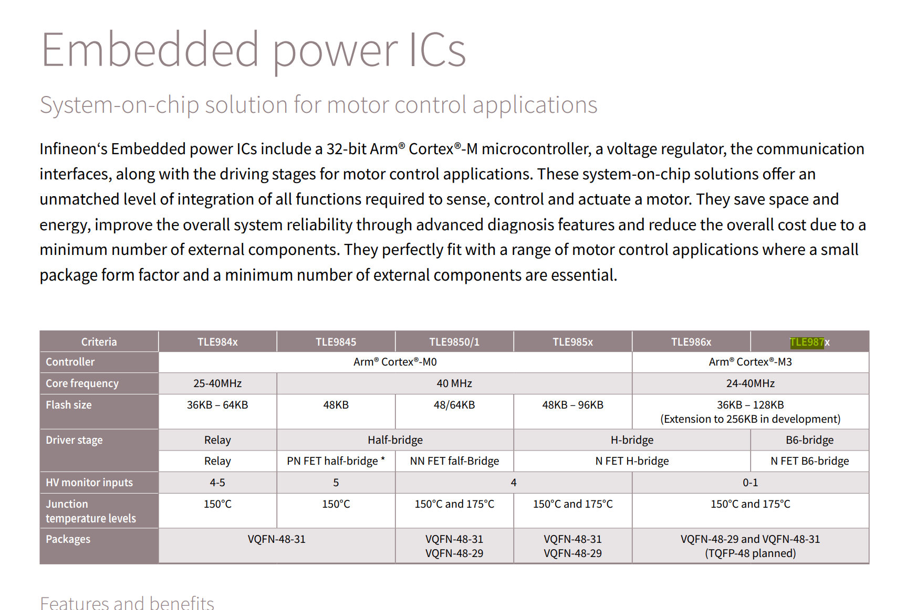

I have been unimpressed with the BLDC ESCs available for a quadcopter. They do not offer telemetry back to the
flight controller, they do not use high-resolution controllers for more advanced or precise control algorithms such
as Field-Oriented-Control, and on top of all that, they are typically fairly expensive at $100 for a 4-in-1 board with
minimal capabilities.

For quadcopter hobbyists who just want to get flying these are acceptable limitations, but as someone interested in developing a quadcopter
as a control systems development platform, the ESCs on the market leave a lot to be desired towards enabling more advanced
control algorithm development for higher performance or more robust flight capabilities (e.g. detecting and handling loss-of-rotor scenarios).

Join me in building something less insane.

# Requirements

## Workable with 4S LiPo battery/motors

i.e. switching 3.7V * 4 = 14.8V gates for motors at 20A continuous should be within the part operating range

## Actually in stock

Lol

## Field Oriented Control

## Sensorless Control

## Simple (ish) PCB design

## Upgradable SW

# Hardware

## Motor Controller MCU

I'm using the Infineon TLE9879 series of MCUs; essentially an ARM Cortex M3 with a gate drive baked into it, simplifying my board
design, reducing size, weight, etc. at the expense of quite an expensive IC. At least it's available for order though ¯\\\_(ツ)_/¯.

For dev boards I'm looking to use the following part:

* [TLE9879QXA40XUMA2](https://www.mouser.com/ProductDetail/Infineon-Technologies/TLE9879QXA40XUMA2?qs=%252BbzPfv9VPAEMx16elAl7ug%3D%3D)

The [Infineon product selection guide](https://www.mouser.com/catalog/additional/Infineon_PowerandSensingSelectionGuide2020_B.pdf) also is helpful
for identifying which families of (their) parts may be relevant for an ESC. Of particular note is this MCU family comparison:

Note that the TLE987x family is the only one that uses a B6 bridge, or a three-phase bridge rectifier, to drive a motor.
This suggests that the TLE987x IC is designed explicitly for brushless motor control, while the other families in the table above
are designed for brushed motor control. I won't go into the details of brushed vs. brushless motor control here -- suffice to say that
brushed motor control is substantially simpler due to a physical commutator, but this is at the expense of motor longevity and performance.

For a higher-performance application like a quadcopter, we will absolutely be sticking to brushless DC (BLDC) motors.

# Software

